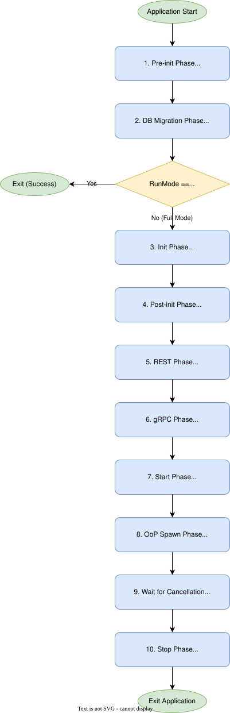

# Lifecycle Phases

The toolkit runtime powers the application lifecycle by executing a deterministic sequence of initialization and startup phases for registered gears. 

The runtime supports two modes of execution: **Full Mode** (normal application startup) and **Migrate-Only Mode** (used for isolated database migrations).

## 1. Pre-init Phase
Executes early initialization hooks. This phase runs **before** any standard initialization and is strictly reserved for gears with the `SystemCapability`.

## 2. DB Migration Phase
Executes database schema migrations for all gears that implement the `DatabaseCapability`. If the runtime is operating in **Migrate-Only Mode**, the process will exit successfully after this phase completes.

## 3. Init Phase
The standard initialization phase where all registered gears perform their core setup and wiring.

## 4. Post-init Phase
A synchronization barrier that runs after all gears have completed their `init` phase. This is also reserved exclusively for `SystemCapability` gears to perform final adjustments before networking starts.

## 5. REST Phase
Synchronously composes the HTTP/REST routing tree for all gears providing a `RestApiCapability`.

## 6. gRPC Phase
Registers all gRPC services exposed by gears implementing the `GrpcServiceCapability`.

## 7. Start Phase
Asynchronously starts background tasks and long-running services for all gears that implement the `RunnableCapability`.

## 8. Out-of-Process (OoP) Spawn Phase
Spawns any out-of-process gears or child processes. This occurs only after the gRPC hub is fully running and able to accept connections.

## 9. Wait for Cancellation
The runtime enters an idle monitoring state, waiting for a shutdown signal (e.g., SIGTERM or SIGINT).

## 10. Stop Phase
Upon receiving a cancellation signal, the runtime gracefully stops all `RunnableCapability` gears in the **reverse order** of their startup, ensuring safe teardown.

---
