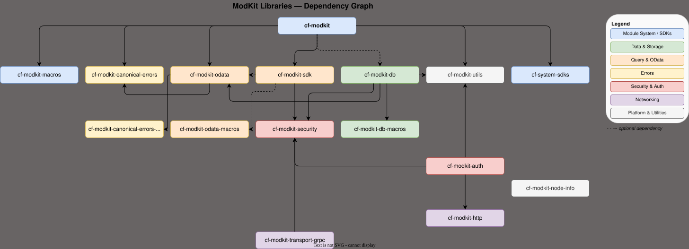

# API Reference

## Libraries

The `libs/` directory contains the foundational crates that make up the ModKit ecosystem. They are organized into functional groups:

### Module System

| Crate | Description |
|---|---|
| `cf-modkit` | Core module system: inventory-based module registration, `ClientHub` for typed in-process clients, REST/OpenAPI helpers, and runtime lifecycle management. |
| `cf-modkit-macros` | Proc-macros re-exported by `cf-modkit`: `#[module(...)]` for declaring and registering modules, `#[lifecycle(...)]` for generating `Runnable` impls, and `#[grpc_client(...)]` for wrapping tonic clients. |

### Data & Storage

| Crate | Description |
|---|---|
| `cf-modkit-db` | Database abstractions: typed connection config, SQLx backends (SQLite / Postgres / MySQL), SeaORM integration, a secure-by-default ORM wrapper that enforces tenant isolation at compile time, and a per-module migration runner. |
| `cf-modkit-db-macros` | Proc-macro derives for the `cf-modkit-db` secure ORM layer. |

### Networking & Transport

| Crate | Description |
|---|---|
| `cf-modkit-http` | HTTP client built on hyper/tower: HTTPS with rustls, connection pooling, configurable timeouts, automatic retries with backoff, concurrency limiting, transparent decompression (gzip/brotli/deflate), and redirect following with SSRF protection. |
| `cf-modkit-transport-grpc` | gRPC transport helpers: attaching and extracting `SecurityContext` via gRPC metadata, and optional Windows named-pipe transport. |

### Error Handling

| Crate | Description |
|---|---|
| `cf-modkit-errors` | Core error data types: RFC 9457 Problem Details (`Problem`), validation error types, and error catalog support. |
| `cf-modkit-canonical-errors` | Canonical error types following the Google AIP-193 model (`InvalidArgument`, `NotFound`, `PermissionDenied`, `Internal`, …) and RFC-9457 `Problem` for HTTP responses. |
| `cf-modkit-canonical-errors-macro` | Proc-macro (`resource_error!`) for declaring resource-scoped error types with generated constructors. |

### Query & Data Access

| Crate | Description |
|---|---|
| `cf-modkit-odata` | OData query building, filter/pagination primitives, schema utilities (`Schema`, `FieldRef`), and page types (`Page`, `PageInfo`). |
| `cf-modkit-odata-macros` | Proc-macros for the OData layer. |
| `cf-modkit-sdk` | Client-side utilities: `WithSecurityContext` for zero-allocation security-context scoping on any client, and a typed OData `QueryBuilder` with compile-time field type checking and deterministic filter hashing for cursor pagination. |

### Security & Authentication

| Crate | Description |
|---|---|
| `cf-modkit-security` | Core security primitives: `SecurityContext`, `AccessScope`, permission/policy engine interfaces, and binary codec helpers. |
| `cf-modkit-auth` | Authentication infrastructure: JWT/JWKS validation (`KeyProvider`, `JwksKeyProvider`, background key refresh), outbound OAuth2 client-credentials flow (`Token` with automatic refresh, `BearerAuthLayer` for tower), and auth metrics. |

### Platform & Utilities

| Crate | Description |
|---|---|
| `cf-modkit-node-info` | Cross-platform system information: hardware-based node UUID (IOKit / machine-id / registry), OS/CPU/memory/GPU/battery/network collection with per-capability cache TTLs, and NVIDIA GPU detection via NVML. |
| `cf-modkit-utils` | Small utility helpers, currently serde support for `humantime` duration serialization. |

### System SDKs

| Crate | Description |
|---|---|
| `cf-system-sdks` | Umbrella crate that re-exports individual system-module SDKs behind feature flags (e.g. `directory`, `directory_grpc`). |